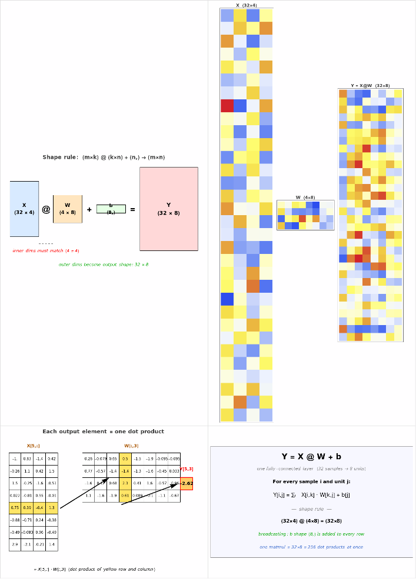

# Matrix Multiplication — What This Code Does

## The code

```python
import numpy as np
X = np.random.randn(32, 4)   # 32 samples, 4 features
W = np.random.randn(4, 8)    # project to 8 units
b = np.zeros(8)
Y = X @ W + b                # shape (32, 8)
print(Y.shape)               # (32, 8)
```

This is **one fully-connected layer of a neural network**, applied to 32 inputs at the same time. It is the most-executed line of code in modern ML.

## Visualization



## Panel-by-panel

### Top-left — Shape rule
The single most important rule of matrix multiplication:

```
(m × k) @ (k × n)  →  (m × n)
```

The **inner dimensions must match** (the `k`'s), and the **outer dimensions become the output shape**.

Here:
- `X` is `32 × 4` — 32 samples, each described by 4 features
- `W` is `4 × 8` — projects 4-D inputs into an 8-D space
- The two 4's cancel; result is `32 × 8`
- `b` is shape `(8,)` — broadcast (added) to every one of the 32 output rows

### Top-right — What the matrices actually look like
Heatmaps of `X` (tall and skinny, 32×4), `W` (small, 4×8), and `Y` (wider, 32×8). You can see `Y` has 8 columns — one per "unit" — and each unit is some learned linear combination of the 4 input features.

### Bottom-left — A single output element is just a dot product
This panel zooms in on `Y[5, 3]` (highlighted in yellow). To compute it:

```
Y[5, 3]  =  X[5, :]  ·  W[:, 3]
         =  (row 5 of X)  dotted with  (column 3 of W)
```

That's it. **Every entry of `Y` is a dot product** between one row of `X` and one column of `W`. The whole matmul is just `32 × 8 = 256` dot products done in parallel.

### Bottom-right — The math, formally

```
Y[i, j] = Σₖ X[i, k] · W[k, j] + b[j]
```

| Symbol | Shape  | Role                                       |
|--------|--------|--------------------------------------------|
| X      | 32 × 4 | batch of input samples                     |
| W      | 4 × 8  | learned weights (one column per output unit) |
| b      | (8,)   | bias, broadcast across all 32 rows         |
| Y      | 32 × 8 | output — 32 samples each with 8 features   |

## How this connects back to yesterday's dot product

The previous file (`test_numpy.py`) computed **one** dot product: `x @ w` where `x` and `w` were both 4-vectors.

This file does the same operation **256 times at once**:
- 32 samples × 8 output units = 256 dot products
- Each is a row of `X` (one sample's 4 features) dotted with a column of `W` (one unit's 4 weights)
- Adding `b` shifts each output unit by a constant (a learnable offset)

Stack a non-linearity (`ReLU`, `tanh`, ...) after this and another `X @ W + b` after that, and you have a **2-layer neural network**.

## Why batching matters

You could write a Python `for` loop over the 32 samples and compute each one separately. It would give the exact same answer — but be 100× slower. `X @ W` ships the whole batch to BLAS/CUDA, which runs all 256 dot products in parallel on vector hardware. **Matmul is the workhorse of ML because it is the most-optimized operation in computing.**
