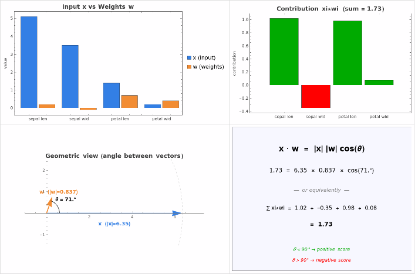

# Dot Product & Vector Norm — What This Code Does

## The code

```python
import numpy as np

x = np.array([5.1, 3.5, 1.4, 0.2])   # input vector (Iris Setosa sample)
w = np.array([0.2, -0.1, 0.7, 0.4])  # weight vector
score = x @ w                         # dot product = 1.73
print(score, np.linalg.norm(x))       # 1.73, 6.345
```

This is the atomic operation behind **every linear classifier and every neuron in a neural network**.

## Visualization



## Panel-by-panel

### Top-left — Input x vs Weights w
The four features of `x` (sepal length, sepal width, petal length, petal width) shown next to their matching weights. Notice `x` has very different scales per feature (5.1 vs 0.2), and `w` includes a **negative** weight on sepal width — meaning that feature *pulls the score down*.

### Top-right — Per-feature contribution xi * wi
Each green bar is a positive contribution, each red bar is a negative one. The four bars sum to **score = 1.73**.

| Feature       | xi   | wi   | xi * wi |
|---------------|------|------|---------|
| sepal length  | 5.1  | 0.2  | +1.02   |
| sepal width   | 3.5  | -0.1 | -0.35   |
| petal length  | 1.4  | 0.7  | +0.98   |
| petal width   | 0.2  | 0.4  | +0.08   |
| **sum**       |      |      | **1.73** |

Petal length is the dominant signal here even though sepal length has the larger raw value — because the weight `0.7` amplifies it.

### Bottom-left — Geometric view
The dot product has a geometric meaning: it measures **how aligned** two vectors are.
- `|x|` = 6.345 (Euclidean length of `x` = `np.linalg.norm(x)`)
- `|w|` = 0.849
- Angle between them: **θ ≈ 71°**

Since θ < 90°, the vectors point in roughly similar directions in 4-D space, so the score is positive.

### Bottom-right — The two equivalent formulas
```
x · w  =  |x| |w| cos(θ)             (geometric form)
       =  Σ xi * wi                  (algebraic form)
1.73   =  6.345 × 0.849 × cos(71°)
       =  1.02 + (-0.35) + 0.98 + 0.08
```

Both formulas always give the same number — that's the whole point of the dot product.

## Why this matters

| Concept                | Where you meet it again                            |
|------------------------|----------------------------------------------------|
| `x @ w` (dot product)  | Single neuron output, logistic regression, attention scores |
| `np.linalg.norm(x)`    | Vector normalization, cosine similarity, gradient clipping |
| Sign of the score      | Binary classification decision (positive/negative class) |
| Angle θ                | Cosine similarity in embeddings / RAG / search |

If you replace `w` with a *learned* vector — one adjusted by gradient descent so that `score` matches a desired label — you have **trained a linear model**. Stack many of these dot products with non-linear activations between them, and you have a neural network.
