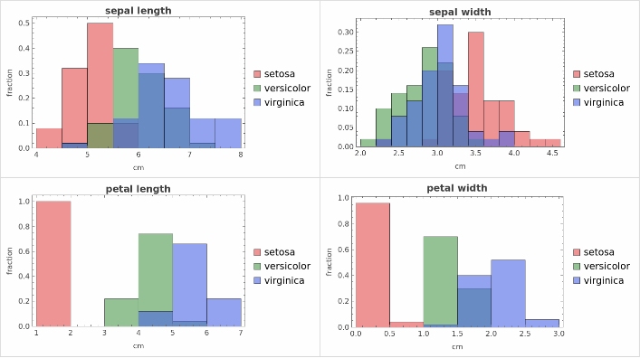
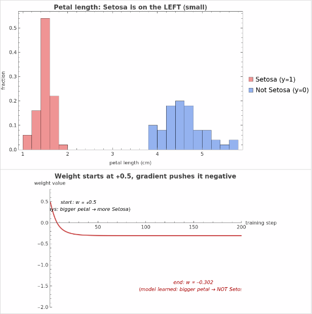

1# Weights — Where Do They Come From, and What Do Negative Weights Mean?

## The two questions

1. How are weights obtained? (Why does petal length get `0.7` and sepal length only `0.2`?)
2. What do negative weights mean, and how is the sign decided?

Short answer: **Weights are not designed. They are learned by gradient descent, and their sign emerges from whether the feature supports or opposes the prediction.**

---

## Part 1 — Weights are learned, not designed

When you see weights like `w = [0.2, -0.1, 0.7, 0.4]`, those numbers weren't picked by a human. They are the result of an algorithm called **gradient descent** running over many examples.

### The training loop, in plain English

```
1. Start with random weights         w = [random, random, random, random]
2. Show the model one flower X with its known species y_true
3. Predict:    score = X @ w
4. Measure:    error = how wrong was score vs y_true?
5. Ask:        which weights, if nudged slightly, would have made
               the error smaller?    <-- this is the gradient
6. Nudge:      w = w - learning_rate * gradient
7. Repeat thousands of times with all the flowers
```

The gradient is just calculus answering one question for each weight:
> "If I increase this weight a tiny bit, does the error go up or down?"

If error goes down -> push the weight up.
If error goes up -> push the weight down.
Repeat until nothing improves anymore.

### Why petal length wins on Iris



Each panel shows one feature, split by species (3 colors).

- **Sepal length & sepal width:** the three species **overlap heavily**. Knowing sepal length tells you almost nothing about the species. -> **weak signal -> small weight**
- **Petal length & petal width:** Setosa (red) is **completely separated** from the other two. Knowing petal length tells you a lot. -> **strong signal -> large weight**

Training does not know any of this in advance. It just discovers it: every time the model uses petal length, the error tends to go down a lot, so the gradient keeps pushing that weight up. Every time it leans on sepal length, the error barely moves, so that weight stays near zero.

**The trained weight vector is the model's compressed answer to: "which features should I pay attention to?"**

---

## Part 2 — Negative weights

A weight is the model saying:

> "When this feature goes UP, my score goes ___."

| Weight | Translation                                  |
|--------|----------------------------------------------|
| +0.7   | "More of this feature -> bigger score"       |
| -0.5   | "More of this feature -> **smaller** score"  |
| ~0     | "I do not care about this feature"           |

A negative weight means the feature is **evidence against** the thing being predicted.

### Spam classifier example

| Word     | Learned weight | Why                              |
|----------|---------------:|----------------------------------|
| free     | +1.2           | Spam loves this word             |
| winner   | +0.9           | Same                             |
| viagra   | +2.0           | Massive spam signal              |
| meeting  | **-0.8**       | Real work emails use this        |
| regards  | **-0.6**       | Professional sign-off, not spam  |
| the      | ~0             | Useless - every email has it     |

The negative weights are not designed. They emerge because those words are **anti-correlated** with spam.

### Iris: same feature, opposite sign depending on the target

| Task                              | Petal length weight | Why                              |
|-----------------------------------|--------------------:|----------------------------------|
| "Is this Virginica?" (big petals) | **positive**        | Bigger petal -> more Virginica   |
| "Is this Setosa?"  (tiny petals)  | **negative**        | Bigger petal -> LESS Setosa      |

The feature did not change. The target changed, so the sign flipped.

---

## Part 3 — How the sign is "decided" (it is not)

This is the surprising part: **the algorithm never decides a weight should be negative.** It just follows gradients.



In this demo (see `learn_weights.py`):

- Top panel: Setosa petals cluster around 1.5 cm; everything else clusters around 4-5 cm.
- Bottom panel: I deliberately started the weight at **+0.5** (wrong sign — the model initially thinks "bigger petal = more Setosa").
- I ran gradient descent for 200 steps.
- The weight **slides through zero and lands around -1.5**, all on its own.

Nobody told it to go negative. The gradient just kept pointing that way every step.

### Why the gradient pointed that way

At each step:

```
gradient = mean over data of  (prediction - truth) * feature_value
new_w   = old_w - learning_rate * gradient
```

For a non-Setosa flower (`y_true = 0`, `feature = 4.5`):
- The model with `w = +0.5` predicts something positive ("Setosa-ish").
- `prediction - truth` is positive (model said yes, truth said no).
- Multiplied by the positive feature value, the gradient is positive.
- `new_w = old_w - positive` -> `w` goes **down**.

This happens 50 times per epoch (one per non-Setosa flower), so the weight steadily slides negative until it reflects reality: "big petal length -> NOT Setosa."

---

## The three takeaways

1. **Weights are not designed - they are learned.** Gradient descent moves each weight in the direction that reduces error.
2. **The sign emerges from the data.** A negative weight just means the feature opposes the target.
3. **Useful features get large weights; useless features get weights near zero.** The model "discovers" which features matter by trying them and seeing what reduces error.

## Try it yourself

```bash
python learn_weights.py
```

You should see the weight start at +0.5 and drift toward -1.5 over 200 steps — the model learning, from data alone, that big petal length is evidence *against* Setosa.
